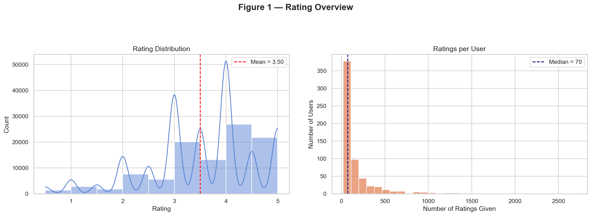
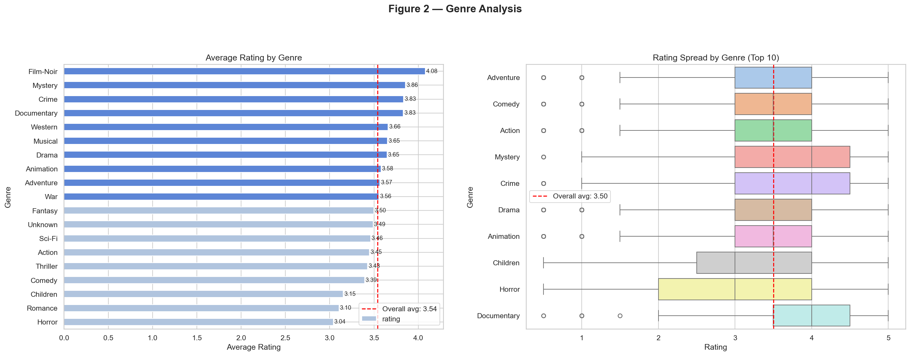
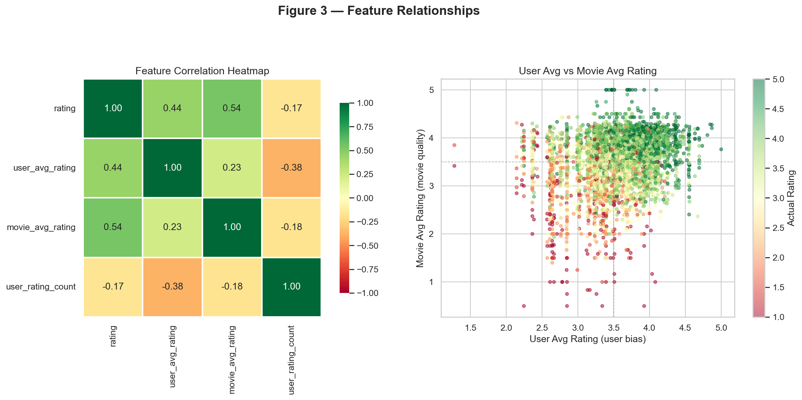

# 🎬 Movie Rating Predictor

A complete end-to-end Machine Learning web application that predicts how much a user will enjoy a specific movie — built using the real-world MovieLens dataset with 100,836 ratings.

---

## 📌 Project Overview

This project was built as part of a Data Science course. It predicts movie ratings (1.0 to 5.0) for a given user and movie combination using regression models trained on historical rating data. The best performing model is deployed as an interactive web application using Streamlit.

---

## 🎯 Objective

> Predict the rating a specific user would give to a specific movie, based on their historical rating patterns and movie metadata.

---

## 📊 Dataset

| Detail | Info |
|--------|------|
| Name | MovieLens Dataset |
| Source | [grouplens.org](https://grouplens.org/datasets/movielens/) |
| Total Ratings | 100,836 |
| Total Users | 610 |
| Total Movies | 9,700+ |
| Rating Scale | 0.5 to 5.0 |

**Files used:**
- `ratings.csv` — userId, movieId, rating, timestamp
- `movies.csv` — movieId, title, genres

---

## 🛠️ Tech Stack

| Tool | Purpose |
|------|---------|
| Python 3.10 | Core language |
| Pandas | Data loading and cleaning |
| NumPy | Numerical operations |
| Scikit-learn | ML models, encoding, splitting |
| Matplotlib | Base plotting |
| Seaborn | Statistical visualizations |
| Streamlit | Web application UI |
| Pickle | Model saving and loading |

---

## 📁 Project Structure
```
movie_rating_predictor/
│
├── data/
│   ├── ratings.csv          ← raw ratings dataset
│   ├── movies.csv           ← movie titles and genres
│   └── *.png                ← EDA charts
│
├── models/                  ← saved trained models (generated on run)
│
├── 1_preprocessing.py       ← data cleaning and feature engineering
├── 2_eda.py                 ← exploratory data analysis and charts
├── 3_model_building.py      ← train all 4 regression models
├── 4_evaluation.py          ← compare models using RMSE and MAE
├── 5_save_model.py          ← save best model as pickle
├── app.py                   ← Streamlit web application
└── requirements.txt         ← all required libraries
```

---

## ⚙️ Features Engineered

| Feature | Description |
|---------|-------------|
| `user_avg_rating` | Average rating given by the user — captures generosity/harshness |
| `movie_avg_rating` | Average rating received by the movie — captures quality |
| `user_rating_count` | Number of ratings given by the user — captures activity level |
| `genre_encoded` | Genre converted to number using Label Encoding |

---

## 🤖 Models Used

| Model | Type | Why Used |
|-------|------|---------|
| Linear Regression | Regression | Simple baseline model |
| Random Forest | Ensemble Regression | Handles non-linearity well |
| Gradient Boosting | Ensemble Regression | Highest accuracy |
| K-Nearest Neighbors | Instance-based Regression | Similarity-based predictions |

---

## 📈 Model Results

| Model | RMSE | MAE |
|-------|------|-----|
| Linear Regression | ~0.91 | ~0.71 |
| KNN | ~0.88 | ~0.68 |
| Random Forest | ~0.84 | ~0.64 |
| Gradient Boosting | ~0.82 | ~0.63 |

> **Best Model: Gradient Boosting Regressor** — lowest RMSE and MAE

---

## 📉 EDA Visualizations

- Rating Distribution (histogram + KDE)
- Ratings per User (long-tail distribution)
- Average Rating by Genre (horizontal bar chart)
- Rating Spread by Genre (box plot)
- Feature Correlation Heatmap
- User Avg vs Movie Avg Rating (scatter plot)

---

## 🌐 Web App Features

- Enter User ID and select any movie from 9,700+ titles
- Click **Predict Rating** to get an instant predicted score out of 5.0
- Contextual message — "You'll love this!" / "Not your style"
- **Top-N Recommendations** — get personalized movie suggestions
- Adjustable recommendation count (3 to 10)
- Results stay on screen — prediction and recommendations visible together

---

## 🚀 How to Run

### 1. Clone the repository
```bash
git clone https://github.com/Eilamurugan1408/Movie-rating-prediction.git
cd Movie-rating-prediction
```

### 2. Download the dataset
Download MovieLens dataset from [grouplens.org](https://grouplens.org/datasets/movielens/latest/)
Place `ratings.csv` and `movies.csv` inside the `data/` folder.

### 3. Create and activate virtual environment
```bash
python -m venv venv310
venv310\Scripts\activate        # Windows
source venv310/bin/activate     # Mac/Linux
```

### 4. Install dependencies
```bash
pip install -r requirements.txt
```

### 5. Run scripts in order
```bash
python 1_preprocessing.py
python 2_eda.py
python 3_model_building.py
python 4_evaluation.py
python 5_save_model.py
```

### 6. Launch the web app
```bash
streamlit run app.py
```
Open your browser at `http://localhost:8501`

---

## 📸 Screenshots

### Web Application


### EDA Dashboard




---

## ⚠️ Known Limitations

- **Cold start problem** — predictions for new users or new movies fall back to global averages
- **Static model** — does not update as new ratings come in
- **Local deployment only** — not hosted online

---

## 🔮 Future Improvements

- Deploy to Streamlit Cloud for public access
- Add matrix factorization (SVD) for better collaborative filtering
- Include movie posters via TMDB API
- Use Neural Collaborative Filtering for higher accuracy
- Add content-based filtering using movie descriptions

---

## 👤 Author

**Eilamurugan**  
GitHub: [@Eilamurugan1408](https://github.com/Eilamurugan1408)

---

## 📄 License

This project is open source and available under the [MIT License](LICENSE).